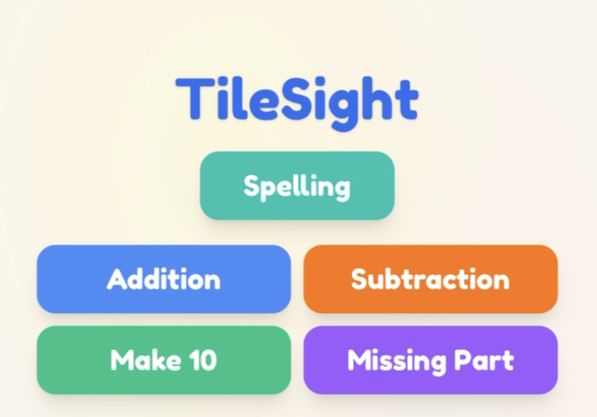
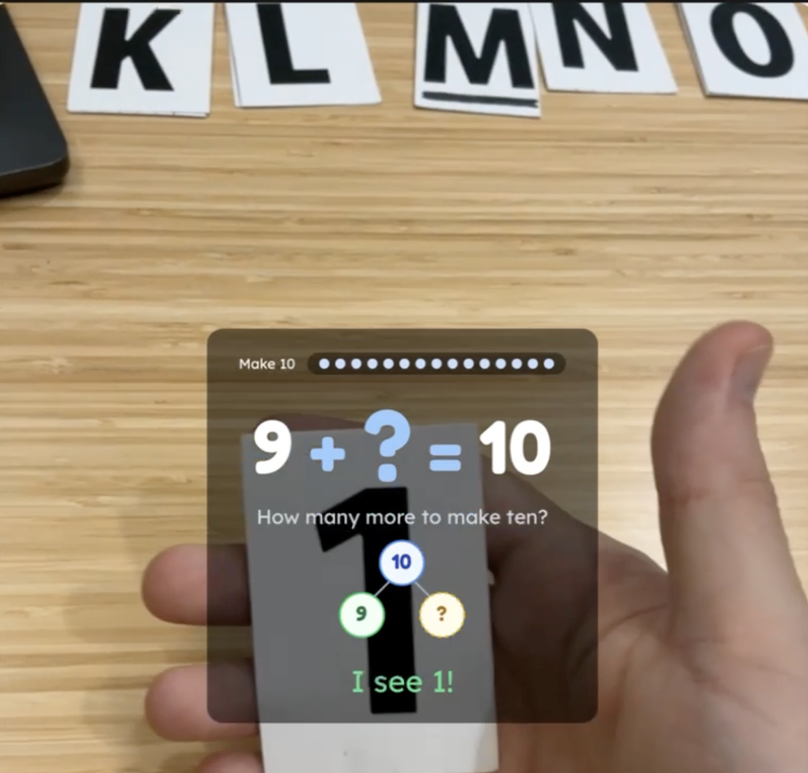
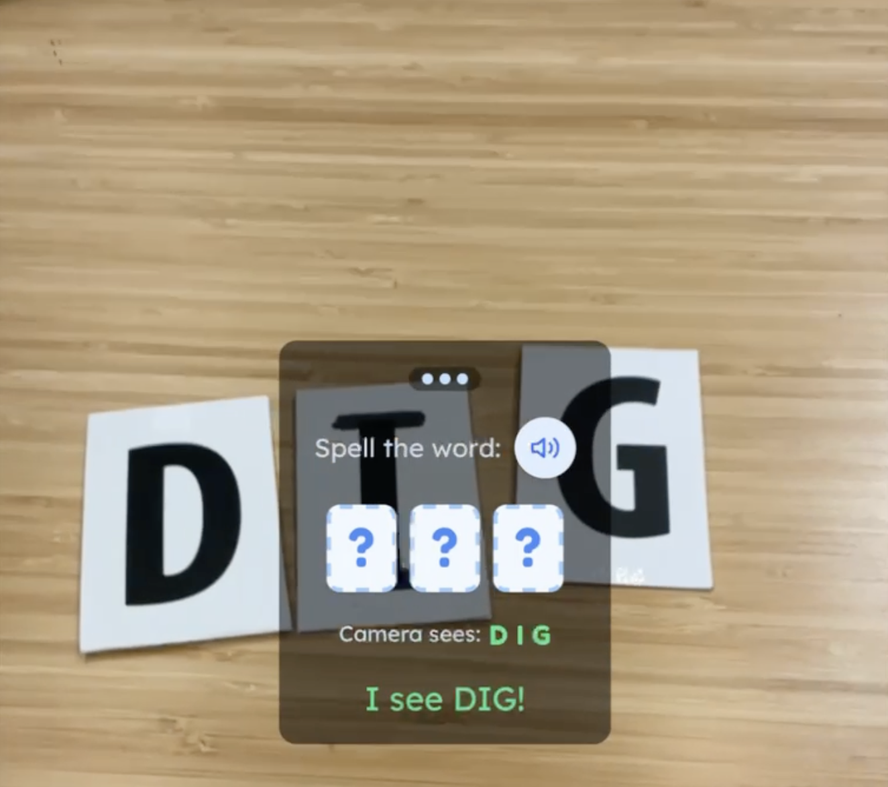

# TileSight

An educational math and spelling game for children ages 5-8. Kids solve problems by placing physical number and letter tiles in front of an iPad camera. The app recognizes tiles in real-time using on-device computer vision — no cloud, no backend, fully offline after first load.

**[Play it live](https://superbuilders-numbergame.pages.dev/)**

<p align="center">
  
  
  
</p>

## How it works

A custom YOLO11n model runs entirely in the browser via WebAssembly in a dedicated Web Worker. The iPad's rear camera captures frames, the model identifies which tiles are visible, and the game engine checks the answer — all on-device. Camera frames never leave the browser.

Five game modes: **Addition**, **Subtraction**, **Missing Part**, **Make 10**, and **Spelling**.

## Getting started

**Prerequisites:** Node.js 22+, pnpm

```bash
pnpm install
pnpm dev
```

The dev server uses [mkcert](https://github.com/nicolo-ribaudo/vite-plugin-mkcert) for local HTTPS (required for camera access). Opens at `https://localhost:5173`.

### iPad testing

Tunnel from a second terminal:

```bash
cloudflared tunnel --url https://localhost:5173
```

## Documentation

| Document | Description |
|---|---|
| [Product Overview](docs/product-overview.md) | Architecture, directory structure, patterns, gotchas |
| [Decisions](docs/decisions.md) | Append-only architecture decision records |
| [Requirements](docs/requirements.md) | Original product requirements |
| [Learning Science Research](docs/learning-science-research.md) | Research synthesis behind instructional feedback |
| [ML Training Pipeline](https://github.com/FlanaganSe/ml-digit-training) | Separate repo for model training |


### Development without a camera

Append `?recognition=mock` to use an on-screen numpad instead of the camera. Add `&debug=true` for stats overlay or `&overlay=boxes` for bounding box visualization.

## Scripts

| Command | Description |
|---|---|
| `pnpm dev` | HTTPS dev server |
| `pnpm build` | Production build (typecheck + Vite) |
| `pnpm test` | Unit tests (Vitest) |
| `pnpm test:watch` | Unit tests in watch mode |
| `pnpm test:e2e` | E2E tests (Playwright WebKit, requires `pnpm build` first) |
| `pnpm lint` | Lint + format check (Biome) |
| `pnpm lint:fix` | Auto-fix lint + format |
| `pnpm typecheck` | TypeScript type checking |

## Privacy

All processing happens on-device. No analytics, no tracking, no external network requests during gameplay. Persistence is localStorage only (cumulative stars, session count, preferences). The app works fully offline after initial load.